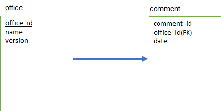

# memo
Fatty liver

## usersテーブル
|Column|Type|Options|
|-------|----|-------|
user_id|integer|primary key, index

### Association
- has_many: user_groups

#### fatty liver
|  |単位|2018.04.05|2018.02.06|2017.08.10|
|--|----|----------|----------|----------|
AST(GOT)|U/L|65|71|37
ALT(GPT)|U/L|146|115|44
